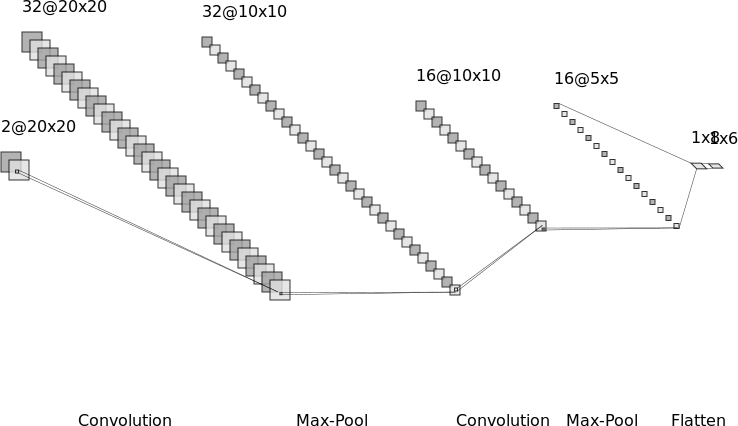
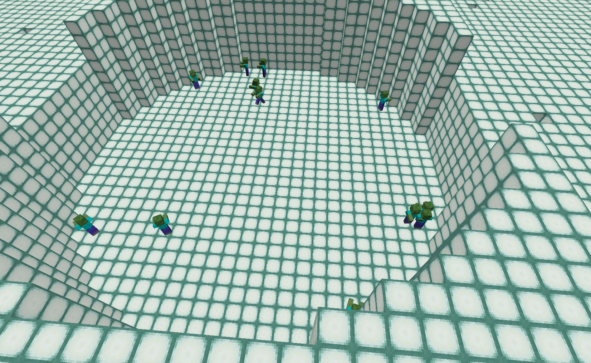
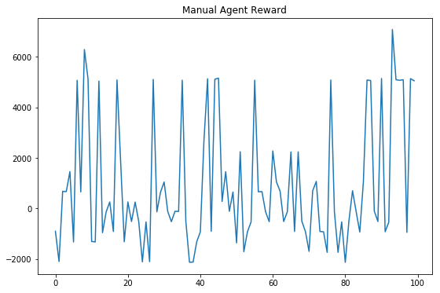
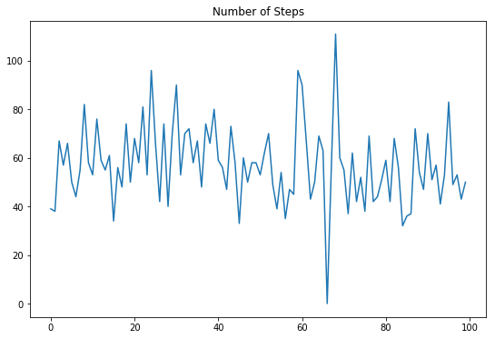
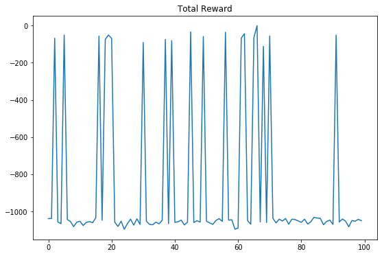
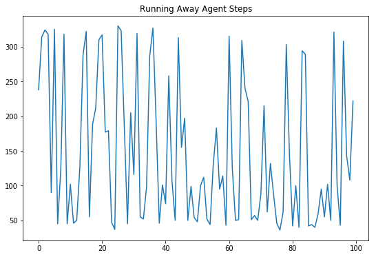
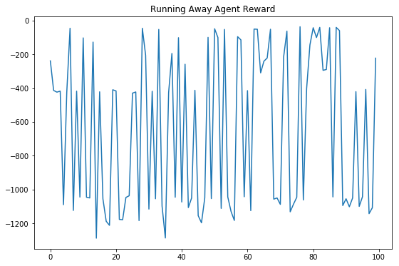

## Spartos Video

<iframe width="560" height="315" src="https://www.youtube.com/embed/GM6M6QyqzAs" frameborder="0" allow="accelerometer; autoplay; encrypted-media; gyroscope; picture-in-picture" allowfullscreen></iframe>

## Project Summary
Our ultimate goal for this Project in AI course was to create a Minecraft fighter bot, dubbed Spartos, whose survival instincts and tactical skills in the battle arena surpassed all others. In the original planning stages, we had envisioned a bot that was able to fight mobs in three scenarios in an arena: passive mobs, aggressive mobs, and endless mobs.

### Progress Iterations
Over the course of the quarter, we narrowed and refined our problem specifications to create the final iteration of Spartos: a fighter bot who specializes in the efficient eradication of aggressive mobs, specifically zombies.

To achieve this goal Spartos, we first distilled the problem to its simplest terms and built up from there. We began with a random agent in a small arena, with a single, non-pursuing zombie as its enemy. As Spartos adapted to this simple environment, we increased the difficulty: increasing the size of the arena, allowing the zombie to pursue Spartos, and increasing the number of zombies spawned. This allowed us to test our implementations of reinforcement learning algorithms. We tested Tabular Q-Learning, Deep Q-Learning, and Vanilla Policy Gradient(VPG) and attempted to implement Proximal Policy Optimization. VPG hit the sweet spot for us between ease of implementation and feasibility for our problem environment. 

### An AI Problem
Just on pure observation of the random agent alone, it is clear why AI/ML algorithms are needed for this problem. Even when we broke our problem down to its simplest terms, the random agent struggles with simply locating its opponent (see our Status video for a demonstration of this). And when we scaled our problem up to its final iteration (pursuant enemies in a large field), a random agent could not conceivably or consistently survive. Machine learning is necessary to solve our proposed problem in any significant way; the agent must learn to seek out its enemies, swing its sword when in range, and, if necessary, evade their attacks. (Please see below for specific details of our implementation approach.)

## Approaches
### Algorithm
We are using Vanilla Policy Gradient as our reinforcment learning algorithm. We've experimented with partially observed states and have found the algorithm to really struggle with human level actions with limited observations. For the final implementation of our project, we give the agent a grid view of nearby zombies relative to his position. We also give Spartos information about his velocity and angle. Notably, we don't give him the position of the walls of the arena. (This was chosen to standardize the information available with our hard-coded agent for comparison).

#### Neural Network Architecure
The first layers of our neural network use the two consecutive layers of the classic Conv2d, ReLu, MaxPooling, Dropout combination to generate a feature vector representing the state of the zombies near the agent. This is concatenated with the agent's position information vector. Two dense layers then output action probabilities.



#### Vanilla Policy Gradient:
We restructured Arthur Juliani's implementation of Vanilla Policy gradient to work with our environment and save checkpoints etc.

Gradient Calculation and Update Equation:


$$ \nabla_\theta J(\pi_\theta) = E_{\tau \sim  \pi_\theta} \left[\sum^T_{t=0} \nabla_{\theta}\log \pi_{\theta}(a_t|s_t)A^{\pi_\theta}(s_t,a_t)\right]$$
$$ \theta_{k+1} = \theta_k + \alpha \nabla_{\theta}J(\pi_{\theta_k}) $$


#### MDP
Using Malmo's "HumanLevelCommands", our agent selects actions analogous to human key presses. It then receives an observation after 4 Minecraft ticks. We discretized time and our action space this way as our goal is to have the agent appear to act as humanly as possible.

### Environment
To achieve our final goal, we increased the size of the arena to a rounded 20x30 rectansgle, spawned a randomly placed horde of 12 zombies.





### State Representation
The algorithm receives as input the state, which is made up of:
- A 20x20 grid view of the zombies positions relative to the agent's position.
- A vector of Spartos' [velocity_x, velocity_z, cos(yaw), sin(yaw)] 

#### Example:
```
zombies: [[0. 0. 0. 0. 0. 0. 0. 0. 0. 0. 0. 0. 0. 0. 0. 0. 0. 0. 0. 0.]
 [0. 0. 0. 0. 0. 0. 0. 0. 0. 0. 0. 0. 0. 0. 0. 0. 0. 0. 0. 0.]
 [0. 0. 0. 0. 0. 0. 0. 0. 0. 0. 0. 0. 0. 0. 0. 0. 0. 0. 0. 0.]
 [0. 0. 0. 0. 0. 0. 0. 0. 0. 0. 0. 0. 0. 0. 0. 0. 0. 0. 0. 0.]
 [0. 0. 0. 0. 0. 0. 0. 0. 0. 0. 0. 0. 0. 0. 0. 0. 0. 0. 0. 0.]
 [0. 0. 0. 0. 0. 0. 0. 0. 0. 0. 0. 0. 0. 0. 0. 0. 0. 0. 0. 0.]
 [0. 0. 0. 0. 0. 0. 0. 0. 0. 0. 0. 0. 0. 0. 0. 0. 0. 0. 0. 0.]
 [0. 0. 0. 0. 0. 0. 0. 0. 0. 0. 0. 0. 0. 0. 0. 0. 0. 0. 0. 0.]
 [0. 0. 0. 0. 0. 0. 0. 0. 0. 0. 0. 0. 0. 0. 0. 0. 0. 0. 0. 0.]
 [0. 0. 0. 0. 0. 0. 0. 0. 1. 2. 1. 0. 0. 0. 0. 0. 0. 0. 0. 0.]
 [0. 0. 0. 0. 0. 0. 0. 1. 2. 1. 1. 0. 0. 0. 0. 0. 0. 0. 0. 0.]
 [0. 0. 0. 0. 0. 1. 0. 0. 0. 1. 0. 0. 0. 0. 0. 0. 0. 0. 0. 0.]
 [0. 0. 0. 0. 0. 0. 0. 0. 0. 0. 0. 0. 0. 0. 0. 0. 0. 0. 0. 0.]
 [0. 0. 1. 0. 0. 0. 0. 0. 0. 0. 0. 0. 0. 0. 0. 0. 0. 0. 0. 0.]
 [0. 0. 0. 0. 0. 0. 0. 0. 0. 0. 0. 0. 0. 0. 0. 0. 0. 0. 0. 0.]
 [0. 0. 0. 0. 0. 0. 0. 0. 0. 0. 0. 0. 0. 0. 0. 0. 0. 0. 0. 0.]
 [0. 0. 0. 0. 0. 0. 0. 0. 0. 0. 0. 0. 0. 0. 0. 0. 0. 0. 0. 0.]
 [0. 0. 0. 0. 0. 0. 0. 0. 0. 0. 0. 0. 0. 0. 0. 0. 0. 0. 0. 0.]
 [0. 0. 0. 0. 0. 0. 0. 0. 0. 0. 0. 0. 0. 0. 0. 0. 0. 0. 0. 0.]
 [0. 0. 0. 0. 0. 0. 0. 0. 0. 0. 0. 0. 0. 0. 0. 0. 0. 0. 0. 0.]]

wallz: [[1. 1. 1. 1. 1. 1. 1. 1. 1. 1. 1. 1. 1. 1. 1. 1. 1. 1. 1. 1.]
 [1. 1. 1. 1. 1. 1. 1. 1. 1. 1. 1. 1. 1. 1. 1. 1. 1. 1. 1. 1.]
 [1. 1. 1. 1. 1. 1. 1. 1. 1. 1. 1. 1. 1. 1. 1. 1. 1. 1. 1. 1.]
 [1. 1. 1. 1. 1. 1. 1. 1. 1. 1. 1. 1. 1. 1. 1. 1. 1. 1. 1. 1.]
 [1. 1. 1. 1. 1. 1. 1. 1. 1. 1. 1. 1. 1. 1. 1. 1. 1. 1. 1. 1.]
 [1. 1. 1. 1. 1. 1. 1. 1. 1. 1. 1. 1. 1. 1. 1. 1. 1. 1. 1. 1.]
 [1. 1. 1. 1. 1. 1. 1. 1. 1. 1. 1. 1. 1. 1. 1. 1. 1. 1. 1. 1.]
 [1. 1. 1. 1. 1. 1. 1. 1. 1. 1. 1. 1. 1. 1. 1. 1. 1. 1. 1. 1.]
 [1. 1. 1. 1. 1. 1. 1. 1. 1. 1. 1. 1. 1. 1. 1. 1. 1. 1. 1. 1.]
 [1. 1. 0. 0. 0. 0. 0. 0. 0. 0. 0. 1. 1. 1. 1. 1. 1. 1. 1. 1.]
 [0. 0. 0. 0. 0. 0. 0. 0. 0. 0. 0. 0. 0. 0. 1. 1. 1. 1. 1. 1.]
 [0. 0. 0. 0. 0. 0. 0. 0. 0. 0. 0. 0. 0. 0. 0. 1. 1. 1. 1. 1.]
 [0. 0. 0. 0. 0. 0. 0. 0. 0. 0. 0. 0. 0. 0. 0. 0. 1. 1. 1. 1.]
 [0. 0. 0. 0. 0. 0. 0. 0. 0. 0. 0. 0. 0. 0. 0. 0. 0. 1. 1. 1.]
 [0. 0. 0. 0. 0. 0. 0. 0. 0. 0. 0. 0. 0. 0. 0. 0. 0. 0. 1. 1.]
 [0. 0. 0. 0. 0. 0. 0. 0. 0. 0. 0. 0. 0. 0. 0. 0. 0. 0. 0. 1.]
 [0. 0. 0. 0. 0. 0. 0. 0. 0. 0. 0. 0. 0. 0. 0. 0. 0. 0. 0. 1.]
 [0. 0. 0. 0. 0. 0. 0. 0. 0. 0. 0. 0. 0. 0. 0. 0. 0. 0. 0. 1.]
 [0. 0. 0. 0. 0. 0. 0. 0. 0. 0. 0. 0. 0. 0. 0. 0. 0. 0. 0. 0.]
 [0. 0. 0. 0. 0. 0. 0. 0. 0. 0. 0. 0. 0. 0. 0. 0. 0. 0. 0. 0.]]
player_state: [ 2.86183589e-02  1.70628617e-05  1.54251450e-01 -9.88031624e-01]
```
### Actions
At any given state, the actions available to the agent are:
["forward 1", "back 1", "left 1", "right 1", "attack 1", "attack 0"]
- Start moving forward
- Start moving backward
- Start moving left
- Start moving right
- Start attacking
- Stop attacking

### Rewards
The agent receives the following rewards for the following events:
- Agent kills zombie: +1000
- Agent takes damage (per damage taken): -5
- Agent dies: -10000
- Agent runs out of time: -100
- Agent doesn't run out of time: 200
- Time(per agent tick): -1.0

## Evaluation
We are using the same evaluation metrics as described in the Status Update to evaluate the progress of our improved agent:
1. Agent taking random actions (same action space as our agent) throughout an entire duration of an episode.
2. Agent (manual Agent) following an algorithm that can form the zombies into a train, and take the ones that get close. Our previous manual agent didn't do well when we changed the layout of our environment to a cylindrical one, so we changed our algorithm for it.

This new algorithm consists of scoring the importance of each zombie based on their distance to the player, and then using that score to determine which direction the player needs to turn to. In addition to turning, the agent moves backward with a probability of 75% and forward otherwise. Seperatly with a probability of 45%, the agent decides to strafe left or right with equal probability. 


Quantitatively, we are evaluating our agent by the total rewards they generate, and by the amount of time it takes for them to complete an episode. Our rewards are simple and clearly imply how many enemies died, and whether the agent died/took damage. We are using a random agent as a baseline, and comparing the random agent with these metrics to the “perfect” agent.

Qualitatively, our goal is for the agent to appear intelligent and behave similarly to a human. We want it to appear to be as close to an efficient killing machine as possible. This means not wasting time attacking nothing, not walking towards enemies, and taking damage. Realistically, this can only be measured by a person watching a video of the agents in action. The “perfect” agent clearly demonstrates a strategy it is using. Please see our video for reference.


  

Reward graph for our manual agent. Since the change in the environment, the manual agent didn't perform as well as the status report. Although we improved the behaviour of the manual agent so that it doesn't get cornered, the number of spots where the agent can get stuck given the algorithm above were many.





Reward and number of steps for our Vanilla Policy Gradient agent. This is the initial reward 




Reward and number of steps for our Vanilla Policy Gradient agent that runs away. For the training of this agent, 
we didn't reward the agent for killing the zombies. Therefore the agent learned how to run away by going in circles.


## References
### RL Algorithms:
- http://incompleteideas.net/book/RLbook2018.pdf
- http://incompleteideas.net/tiles/tiles3.html
- https://medium.com/@awjuliani/super-simple-reinforcement-learning-tutorial-part-2-ded33892c724
- https://spinningup.openai.com/en/latest/algorithms/vpg.html

### Implementation Examples:
- https://medium.com/emergent-future/simple-reinforcement-learning-with-tensorflow-part-0-q-learning-with-tables-and-neural-networks-d195264329d0
- https://medium.com/@awjuliani/super-simple-reinforcement-learning-tutorial-part-2-ded33892c724
- https://medium.freecodecamp.org/an-introduction-to-deep-q-learning-lets-play-doom-54d02d8017d8?gi=8d7e34546ac3
- https://adventuresinmachinelearning.com/reinforcement-learning-tensorflow/
- https://github.com/openai/gym/blob/master/gym/envs/classic_control/mountain_car.py
