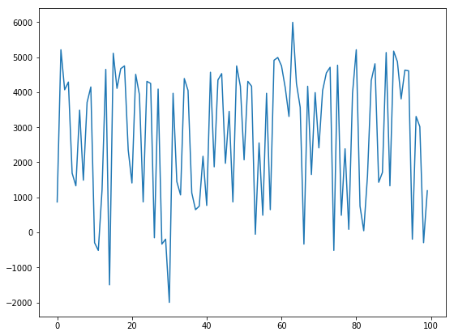
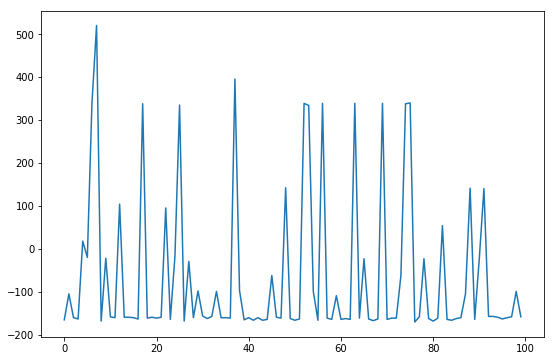
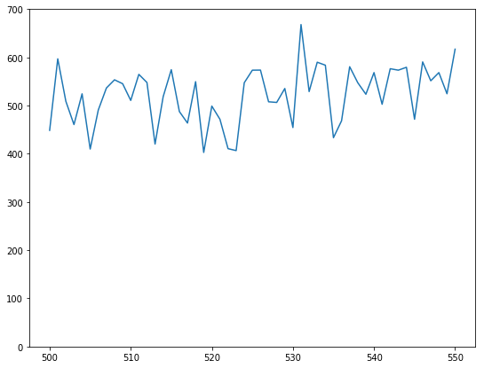

<iframe width="560" height="315" src="https://www.youtube.com/embed/rSvrI0kUoNo" frameborder="0" allow="accelerometer; autoplay; encrypted-media; gyroscope; picture-in-picture" allowfullscreen></iframe>

## Project Summary
Our original goal was to have the agent (Spartos) learn how to fight against three different types of mobs on the field, altering its battle strategy according to the type of mob encountered (passive mobs, aggressive mobs, endless mobs)

This was scaled down due to feasibility issues. We decided that, out of all the possible battle strategies Spartos could learn from our previous idea, we wanted to prioritize a hyper-aggressive agent that values pursuing enemies as much as possible. Our updated problem formulation is as follows:

__Baseline__: 
Spartos learns to kill a single zombie in a small 5x5 arena. This is the simplest case reduction of the final agent we eventually want to train. From here we hope to scale up to a mob of zombies in a larger and potentially varied arena.

__Target__: 
After successfully training Spartos to hunt a single enemy, the next step will be to add the complexity of hunting and surviving multiple enemies at once. To accomplish this, we will increase the size of the arena to 20x20 and gradually add more zombies, with a max horde size of 5.

__Goal__: 
The ultimate goal for Spartos will be for it to either fight well against a variety of enemies, or in a complicated arena (or potentially both if time allows). We will start by adding different enemies and adding obstacles to the arena separately. If both work reasonably well, we will attempt to merge the 2 environments.

## Approach
We are using Vanilla Policy Gradient as our reinforcment learning algorithm. We've experimented with observing position and position + velocity. Currently, we have position and velocity represented as floats for the x and z dimensions.

In our Baseline scenario, the agent receives as its observation solely it's current position. The Vanilla Policy Gradient algorithm predicts action probabilities and an action is selected based on those probabilities. Notably, it observes nothing related to the location of the zombie in the room. Weights are updated every 5 episodes based on the discounted rewards over each episode. 

### Vanilla Policy Gradient:
We restructured Arthur Juliani's implementation of Vanilla Policy gradient to work with any environment and save checkpoints etc.

Gradient Calculation and Update Equation:


$$ \nabla_\theta J(\pi_\theta) = E_{\tau \sim  \pi_\theta} \left[\sum^T_{t=0} \nabla_{\theta}\log \pi_{\theta}(a_t|s_t)A^{\pi_\theta}(s_t,a_t)\right]$$
$$ \theta_{k+1} = \theta_k + \alpha \nabla_{\theta}J(\pi_{\theta_k}) $$


To achieve our baseline goal, we've spawned the agent, equipped with an enchanted sword, and a single zombie in a flat 5x5 room with no obstacles. Both the agent and the zombie consistently appear at the same location. Notably, the location of the zombie isn't represented anywhere in the agent's observation of the environment.

### MDP
Using Malmo's "HumanLevelCommands", our agent selects actions analogous to human key presses. It then receives an observation after 4 Minecraft ticks. We discretized time and our action space this way as our goal is to have the agent appear to act as humanly as possible.

### State
The algorithm receives as input the state, which is made up of:
- Coordinates of the agent

### Actions
At any given state, the actions available to the agent are:
["forward 1", "back 1", "left 1", "right 1", "attack 1", "attack 0"]
- Start moving forward
- Start moving backward
- Start moving left
- Start moving right
- Start attacking
- Stop attacking

### Rewards
The agent receives the following rewards for the following events:
- Agent lands successful hit/kill: +400 (this reward is given to the agent based on damage dealth)
- Agent takes damage (per damage taken): -5
- Agent dies: -1000
- Agent runs out of time: -100
- Agent doesn't run out of time: 200
- Time(per agent tick): -1.0

## Evaluation

### Agents to Compare Against
To evaluate our learning model, we developed two agents that we can compare agent to:  
1. Agent taking random actions (same action space as our agent) throughout an entire duration of an episode.
2. Agent following an algorithm that can form the zombies into a train, and take the ones that get close. This algorithm consists of scoring the importance of each zombie based on their distance to the player, and then using that score to determine which direction the player needs to turn to. In addition to turning, the agent moves backward with a probability of 65%, and for the remaining 35%, the agent decides to strafe left or right with equal probability.

### Comparison Metrics
Quantitatively, we evaluate our agents by the total rewards they generate and amount of time they take per episode.  Our rewards are simple and clearly imply how many enemies died, and whether the agent died/took damage. Most importantly our agent is compared in these metrics with the random agent and the "perfect" agent. 

Qualitatively, our goal is for the agent to appear intelligent. We want it to appear to be as close to an efficient killing machine as possible. This means not wasting time attacking nothing, not walking towards enemies, and taking damage. Realistically this can only be measured by a person watching a video of the agents acting. The "perfect" agent clearly demonstrates a strategy it is using.

Here are some graphs from the rewards during our training:

Fig 1. Manual Agent, the agent following the algorithm described above. This graph is the rewards for the agent in a 30x30 maze with 12 zombies and 5 cows. A demo of this agent is included at the end of the video.

Fig 2. Initial rewards from our agent taking mostly random actions. The negative rewards is due to taking damage from the stationary zombie or running out of time without successfully killing the zombie.

Fig 3. Rewards from the agent after 500 episodes of training. We saw that our agent did learn where the zombie is and how to kill, but there were still times were the agent failed to kill the zombie within the first 10 seconds. There were also times where the zombie took more than 400 damage from the sword, which resulted in a higher score (This might be due to difference in where the zombie was hit, e.g. in the head vs the body).

## Remaining Goals & Challenges
- Put Spartos against a variety of enemies, or a horde of one type of enemy
    - We intend to represent observations with multiple enemies as gridworlds and add convolutional layer(s) to our neural network.
- Reduce strength of sword so Spartos has to go in for multiple hits
    - An observation will be the total health of enemies in a given tile.
    - We also plan to add our agent's health to his state.
- Add verticality to the arena by adding obstacles and cliffs

- One of our main challenges has been handling Malmo errors with our high tickrate. We train at ~15x Minecraft's normal rate and this causes issues where we don't get observations for long periods of time sometimes forever.

## Resources Used
__RL Algorithms__: 
- http://incompleteideas.net/book/RLbook2018.pdf
- http://incompleteideas.net/tiles/tiles3.html
- https://medium.com/@awjuliani/super-simple-reinforcement-learning-tutorial-part-2-ded33892c724
- https://spinningup.openai.com/en/latest/algorithms/vpg.html

__Implementation Examples__: 
- https://medium.com/emergent-future/simple-reinforcement-learning-with-tensorflow-part-0-q-learning-with-tables-and-neural-networks-d195264329d0
- https://medium.com/@awjuliani/super-simple-reinforcement-learning-tutorial-part-2-ded33892c724
- https://medium.freecodecamp.org/an-introduction-to-deep-q-learning-lets-play-doom-54d02d8017d8?gi=8d7e34546ac3
- https://adventuresinmachinelearning.com/reinforcement-learning-tensorflow/
- https://github.com/openai/gym/blob/master/gym/envs/classic_control/mountain_car.py
